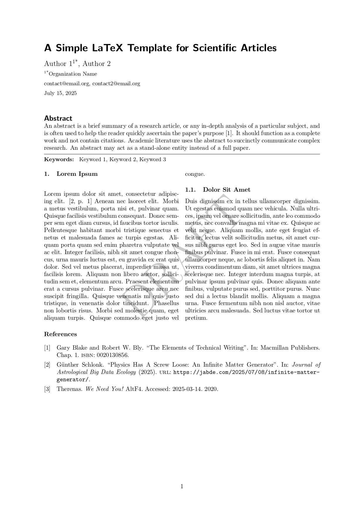

# A Simple LaTeX Template for Scientific Articles

This repository provides a simple, custom built LaTex template for scientific articles.
It supports most important features for scientific writing.
By default the article is double column and provides an abstract.
Double column can be easily disabled by removing the multicolumn environment.
The template is highly adaptable and easy to use.

## Features

- **Multiple Authors**\
The template supports an arbitrary amount of authors, contact information and affiliations. The Authors can be linked to their affiliations with an arbitrary identifier, which is printed in superscript.
- **Keywords**\
The package provides a simple way to define keywords. Keywords are automatically printed by the `abstract` environment as well as the `\noabstract` command, or can be printed manually by `\putkeywords`.
- **Consistent Title Sizes**\
Section and subsection titles are identified by their numbering, not the font size. All titles have a font size consistent with the text font.
- **Multi-Column**\
Multiple columns are implemented using the `multicol` package. This implements an environment allowing the user to define the number of columns directly in the code.

## Dependencies
Only common dependencies are required. As such this template is completely ArXiv compatible using the pdflatex compiler. (Compare [this list](https://info.arxiv.org/help/texlive_package_list.html))

- `biblatex`
- `titling`
- `hyperref`
- `appendix`

Users may want to additionally include the following packages:
```latex
\usepackage{siunitx} %For SI-Units
\usepackage{csquotes} %For consisten quotation with \enquote
\usepackage{amsfonts} %For mathematical symbols
\usepackage{amsmath} %For math environments (align, align*, equation*})

\usepackage{graphicx,float} %For [H] specifier, not supported by ArXiv
\usepackage{pst-graphicx,float} %Graphicx version supported by ArXiv, untested
``` 

## Why this Repository Exists

The commands in this LaTex template are inspired by the Springer-Nature template, but as opposed to the Springer-Nature template this repository compiles. The template is easily adaptable to many different applications and provides a high degree of control to the user.

## Preview
